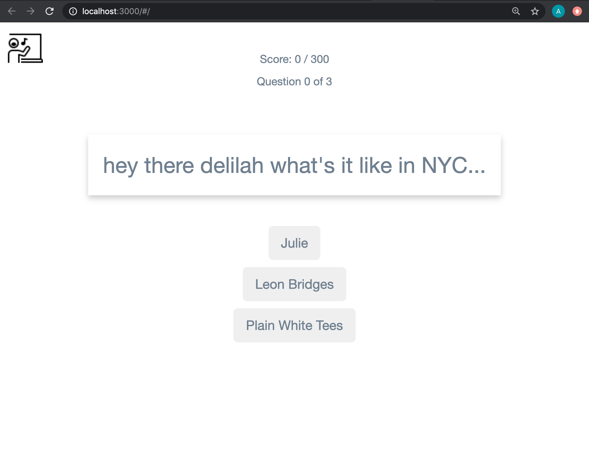
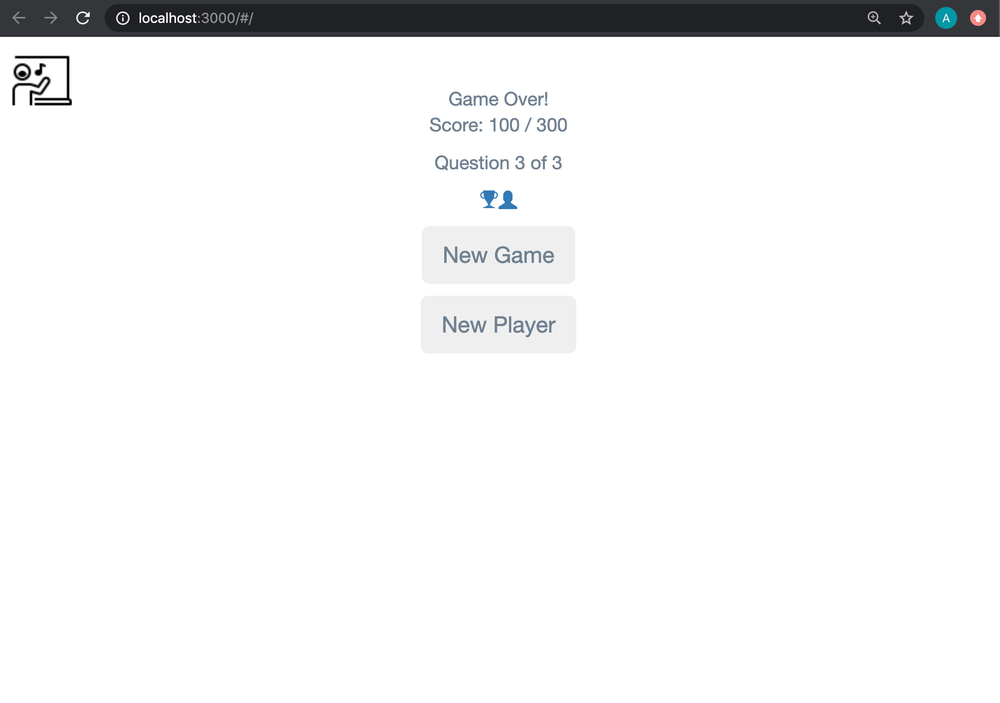
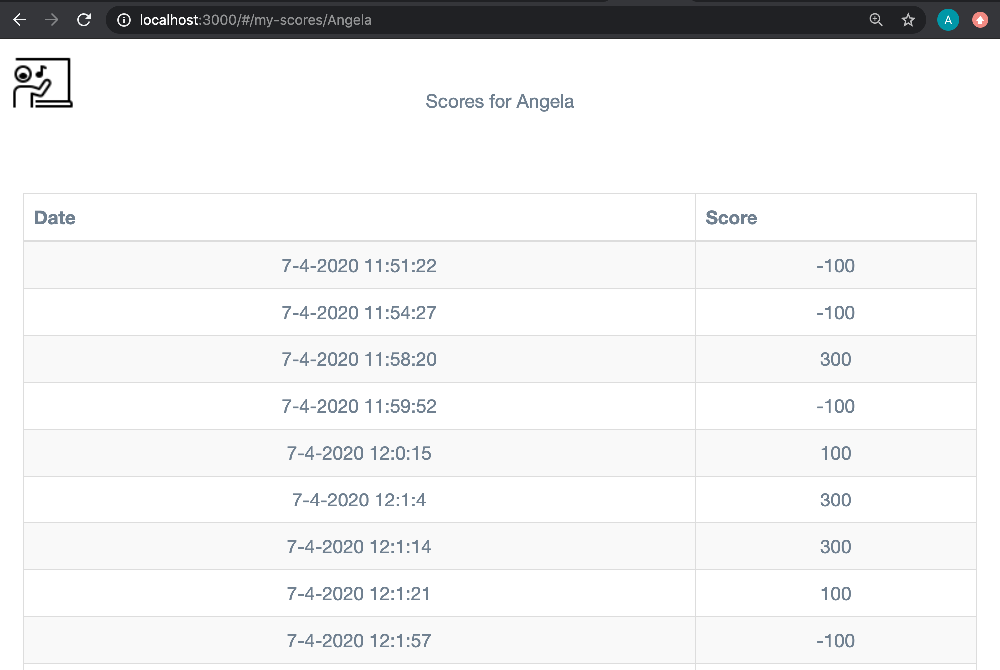
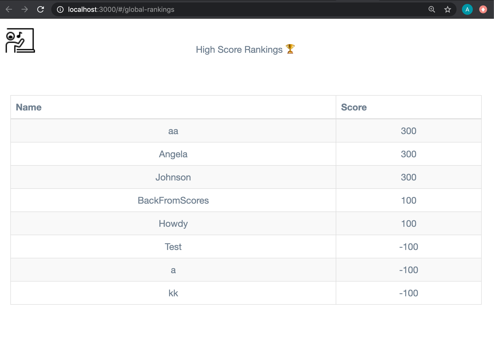

# Welcome to WhoSings! 
This is an app that uses the MusiXmatch API to create a quiz. Lyrics are shown and player has to guess Artist behind the lyrics. 

### 1. `Home Screen:`
This frist screen requires player name. Game uses `localStorage` to collect scores per player name. 

### 2. `Quiz Screen:`
What playing the game looks like. Rendered is the `QuizCard` component, with children components, `Lyric`, `Artist`.

### 2. `End Game Screen:`
Rendered is the `QuizCard` component, with children components, `NewGameButton`, `StatsBar`. Icons link to score rankings pages. 

### 2. `Personal Score Screen:`
Shows date and score of all attempts per player. Notice wildcard in frontend rounte. Rendered is the `MyScore` component, with children components, `TableWrapper`, `Score`.

### 2. `High Scores Screen:`
Shows name and highest score per player. Presented in order from highest to lowest. Rendered is the `GlobalScore` component, with children components, `TableWrapper`, `Score`.

#### `yarn start`
Runs the app in the development mode. 
Open [http://localhost:3000](http://localhost:3000) to view it in the browser.

The page will reload if you make edits. 
You will also see any lint errors in the console.

This project was bootstrapped with [Create React App](https://github.com/facebook/create-react-app).